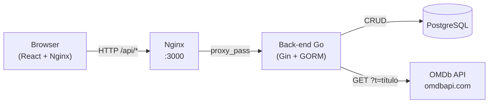

# CineList — Front-end (React)

Interface web desenvolvida em React com Material UI para gerenciar uma lista pessoal de filmes. Possui tema dark/light, dashboard com métricas, filtros por status, layout responsivo e skeleton screens.

## Tecnologias

- **React 18** + **Vite** (bundler)
- **Material UI v6** (componentes visuais, tema customizado)
- **Inter** (tipografia via Google Fonts)
- **Axios** (chamadas HTTP)
- **Nginx** (servidor estático no container)

## Funcionalidades

- Busca de filmes via OMDb API
- Adição, remoção e marcação como assistido
- Avaliação pessoal com estrelas (1–5)
- Dashboard com cards de métricas clicáveis (filtro por total / assistidos / pendentes / avaliados)
- Tema dark/light com toggle no header
- Layout responsivo: cards verticais no desktop, lista compacta no mobile
- Skeleton screens durante carregamento
- Notificações toast para todas as ações

## Repositórios

Este projeto é composto por dois repositórios que **devem estar clonados na mesma pasta pai** com os nomes exatos abaixo, pois os `docker-compose.yml` referenciam um ao outro via caminho relativo (`../`):

```
pasta-qualquer/
├── mvp-ARQSW-backend/    ← https://github.com/vinibodruch/mvp-ARQSW-backend
└── mvp-ARQSW-frontend/   ← https://github.com/vinibodruch/mvp-ARQSW-frontend
```

```bash
git clone https://github.com/vinibodruch/mvp-ARQSW-backend
git clone https://github.com/vinibodruch/mvp-ARQSW-frontend
```

## Pré-requisitos

- Docker e Docker Compose instalados
- Chave da [OMDb API](https://www.omdbapi.com/apikey.aspx) (gratuita)
- Os dois repositórios clonados conforme a estrutura acima

## Configuração

Edite o arquivo `.env` na raiz do projeto e substitua `sua_chave_aqui` pela sua chave da OMDb caso necessário. Porém, no `.env`, já existe uma chave configurada por questões de facilidade de avaliação.

### Como obter a chave da OMDb API

Caso a chave não funcione ou precise gerar uma nova:

1. Acesse https://www.omdbapi.com/apikey.aspx
2. Selecione o plano **FREE** (1.000 buscas/dia, sem custo)
3. Preencha nome e e-mail, clique em **Submit**
4. Acesse o e-mail recebido e clique no link de ativação
5. Copie a chave exibida e cole no `.env`

## Executar com Docker Compose

Todos os comandos devem ser rodados dentro da pasta `mvp-ARQSW-frontend`:

```bash
# Subir todos os serviços (frontend + backend + banco de dados)
docker compose up --build

# Rodar em segundo plano
docker compose up --build -d

# Parar os serviços
docker compose down

# Parar e remover o volume do banco de dados
docker compose down -v
```

Após subir, acesse: **http://localhost:3000**

## Arquitetura



> O back-end e o banco de dados não expõem portas para o host. O Nginx faz proxy das chamadas `/api/*` para o container do back-end.

## Estrutura de Serviços

| Serviço | Container | Porta |
|---|---|---|
| Front-end (Nginx) | movie_frontend | 3000 |
| Back-end (Go) | movie_backend | interno |
| Banco de Dados | movie_db | interno |
